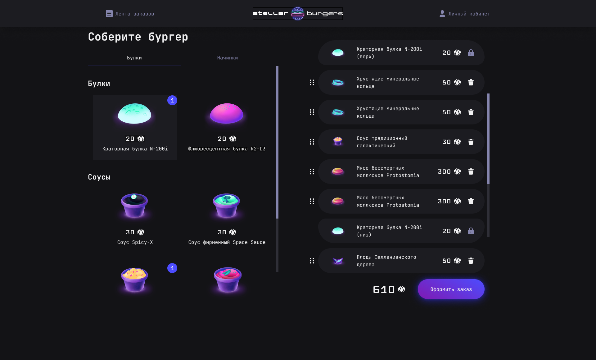

# Stellar Burgers

Космическая бургерная — приложение для сборки и заказа бургеров. Каталог ингредиентов, конструктор бургера drag-and-drop, лента заказов в реальном времени, личный кабинет с историей заказов, авторизация и защищённые маршруты.

<p align="center">
  <a href="https://vovchensky.github.io/stellar-burgers/">
    
  </a>
</p>

## Технологии

- React (функциональные компоненты, хуки)
- TypeScript
- Redux Toolkit (слайсы, createAsyncThunk, selectors)
- React Router v6 (защищённые маршруты, модальные окна по роутам)
- REST API (авторизация, CRUD заказов, ингредиенты)
- Jest (юнит-тесты редьюсеров и слайсов)
- Cypress (интеграционные тесты конструктора, модальных окон, создания заказа)

## Запуск

```bash
npm install
npm run start
```

## Тесты

```bash
# Юнит-тесты
npm run test

# Интеграционные тесты
npm run cypress
```
